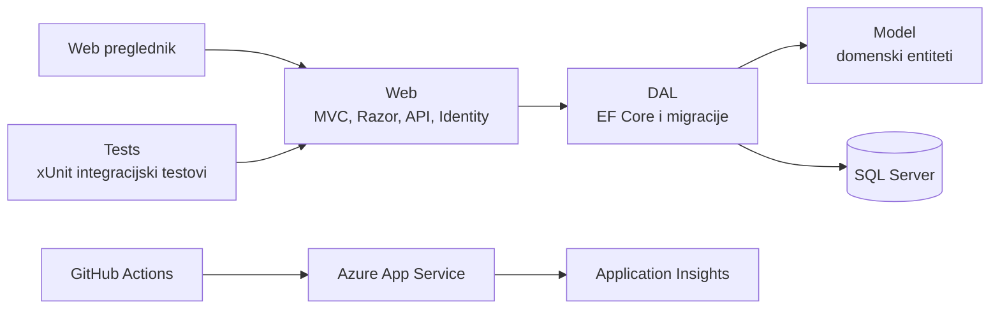

<p align="center">
  
</p>

<h1 align="center">KinoKlik</h1>

<p align="center">
  ASP.NET Core aplikacija za pregled kino programa i vođenu rezervaciju sjedala.
</p>

<p align="center">
  <a href="https://cinema-bv-fuheftdfbyazaqea.italynorth-01.azurewebsites.net/"><strong>Live demo</strong></a>
  ·
  <a href="https://cinema-bv-fuheftdfbyazaqea.italynorth-01.azurewebsites.net/swagger">Swagger / OpenAPI</a>
  ·
  <a href="docs/DEVELOPMENT.md">Razvojna dokumentacija</a>
</p>

[](https://github.com/Bovna/kinoklik/actions/workflows/main_cinema-bv.yml)
[](https://github.com/Bovna/kinoklik/actions/workflows/ci.yml)
[](https://github.com/Bovna/kinoklik/actions/workflows/secret-scan.yml)


KinoKlik je portfolio projekt koji demonstrira razvoj i produkcijsko održavanje cjelovite ASP.NET Core MVC aplikacije. Posjetitelji mogu pregledavati filmove, kina i projekcije te proći cijeli tok rezervacije, dok su upravljanje podacima i promjene kroz API zaštićeni korisničkim rolama.

> [!NOTE]
> Aplikacija je demonstracijska: nema stvarne naplate, svi početni podaci su izmišljeni i u obrasce ne treba unositi stvarne osobne podatke. Prvo otvaranje nakon dulje neaktivnosti može potrajati zbog Azure App Service Free plana i Azure SQL serverless baze.

## Isprobaj aplikaciju

1. Otvori [live demo](https://cinema-bv-fuheftdfbyazaqea.italynorth-01.azurewebsites.net/).
2. Odaberi **Kupi ulaznicu**.
3. Prođi tok kino → film → projekcija → sjedalo → potvrda.
4. Za checkout koristi isključivo izmišljene podatke.

Administratorski i managerski računi nisu javno dostupni. Njihove mogućnosti i zaštićene rute mogu se pregledati kroz kod i javnu [OpenAPI dokumentaciju](https://cinema-bv-fuheftdfbyazaqea.italynorth-01.azurewebsites.net/swagger).

## Izdvojene mogućnosti

- katalog filmova, kina i projekcija s globalnom i AJAX pretragom
- vođeni booking u pet koraka sa sjedalom, cijenom i potvrdom
- zaštita od dvostruke rezervacije na aplikacijskoj i SQL razini
- ASP.NET Core Identity, opcionalna Google prijava i `Admin`/`Manager` autorizacija
- MVC sučelje i REST API s odvojenim DTO modelima
- soft delete domenskih podataka i upravljanje filmskim vizualima
- integracijski testovi API-ja, autorizacije, pretrage, uploada i cijelog booking toka
- automatizirani build, test i Azure deploy uz nadzor i skeniranje repozitorija za tajne

## Tehnologije

| Područje | Tehnologije |
| --- | --- |
| Backend | .NET 8, ASP.NET Core MVC, Razor Pages, Web API |
| Podaci | Entity Framework Core 8, SQL Server, EF migracije |
| Sigurnost | ASP.NET Core Identity, role, antiforgery zaštita, Google OAuth |
| Frontend | Razor, Bootstrap, JavaScript, AJAX |
| Testovi | xUnit, FluentAssertions, WebApplicationFactory, SQL Server integration |
| Produkcija | Azure App Service, GitHub Actions, Application Insights |

## Arhitektura



Repozitorij sadrži četiri projekta:

- `KinoKlik/Model` — domenski entiteti i enumeracije
- `KinoKlik/DAL` — EF Core kontekst, konfiguracija baze, seed podaci i migracije
- `KinoKlik/Web` — MVC sučelje, API kontroleri, Identity, booking i upload
- `KinoKlik/Tests` — integracijski, autorizacijski i sigurnosni testovi

## Lokalno pokretanje

Potrebni su [.NET 8 SDK](https://dotnet.microsoft.com/download/dotnet/8.0) i SQL Server ili SQL Server LocalDB.

```powershell
dotnet tool restore --tool-manifest KinoKlik\Web\dotnet-tools.json
dotnet restore KinoKlik\KinoKlik.sln
dotnet ef database update --project KinoKlik\DAL\KinoKlik.DAL.csproj --startup-project KinoKlik\Web\KinoKlik.Web.csproj
dotnet run --project KinoKlik\Web\KinoKlik.Web.csproj
```

Zadana razvojna konfiguracija koristi LocalDB. Drugi SQL Server, razvojni računi i ostale postavke opisani su u [razvojnoj dokumentaciji](docs/DEVELOPMENT.md).

## Testovi

```powershell
dotnet test KinoKlik\KinoKlik.sln --configuration Release
```

Testovi pokrivaju javne i zaštićene rute, autorizaciju, validaciju, pretragu, upload, health checkove, Swagger i cijeli booking tok.

## Ograničenja demo aplikacije

- checkout simulira potvrdu rezervacije i nije spojen na payment provider
- trenutačno je moguće rezervirati jedno sjedalo po kupnji
- privilegirani produkcijski računi nisu javno dostupni

Detalji konfiguracije, migracija, testnog SQL okruženja, deploya i nadzora nalaze se u [`docs/DEVELOPMENT.md`](docs/DEVELOPMENT.md).
